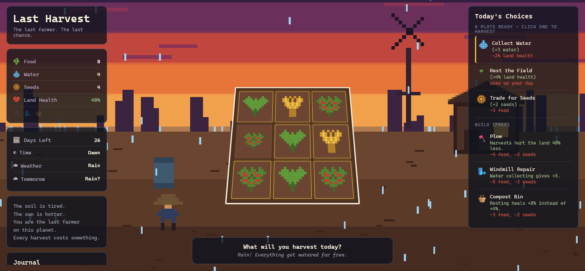

# Last-Harvest

A tiny narrative/strategy game where you're the last farmer on a dying planet, and each turn you choose what to harvest knowing it shortens the land's life. It's a resource management game about scarcity and sacrifice rather than abundance — the opposite emotional register of every cozy farming game out there.

## Tech Stack

this game is made entirely using pure html, css and javascript

there are no sprites (all graphics are svgs that are built using code)

## Features

## Menu

### Difficulty selection

at the start of the game in the menu

you will have the choice to pick the difficulty you want to play in

**- easy mode** -> this is the easier version where

- the land drift is 1 (your land health increases by 1 every day)
- the damage on the soil from harvesting is decreased by 40%
- you start with 15 food and 10 water and 8 seeds
- forecasts are 75% accurate

**- normal mode** -> this is the normal version that is intended for people to play where

- the land drift is 0 (your land health is only affected by the weather and your actions)
- the damage on the soil from harvesting stays the same
- you start with 12 food and 8 water and 6 seeds
- forecasts are 50% accurate

**- hardcore mode** -> this is the hard mode for sweaty players and people who want a challenge where

- the land drift is -1 (your land naturally decays by 1)
- the damage on the soil from harvesting is increased by 40%
- you start with 10 food and 6 water and 4 seeds
- forecasts are 30% accurate
- supply consumption is 2 (you need 2 food and 2 water each day to survive instead of 1)

### How to play menu

there is a how to play menu for new players to understand the core mechanics of the game

### saving/loading games

the game automatically saves to local storage after core actions

you can load your game by clicking the continue button

## Game Mechanics

### Core surviving mechanic

after each day you will consume 1 food and 1 water (2 if you are in hardcore mode) and if your food or water run out you die

### Land Health

land health is how well your land is

if land health reaches 0 you lose

harvesting crops, gathering water, and natural land drift decrease the land health

to increase your land health you have to let the land rest which takes a day

to increase the amount of health gained by resting the land you can build the compost bin to increase the recovered health from 4% to 8%

### Color Grading

Land health also changes the theme of the game

using a 3 point linear gradient each weather,sun, glow, and soil has 3 themes which are set as the points and using the lerpColor function i get something in between

the normal color palette is at 50 (the center)

the range of the land health is 0:100 but the actual range of the themes is -50:150

this is done to let each asset keep its identity while also getting affected by the health

### Weather

the game has a weather mechanic which is determined randomly

- Clear -> 45% of showing up, the normal weather where crops dry out by 1 point and the land drift is -1 (the land health decreases by 1)
- Rain -> 20% of showing up, this is a rainy weather where crops do not dry out and the land drift is 1 (the land health increases by 1) and also waters all your crops for free
- HeatWave -> 20% of showing up, the scorching sun is pointing at the crops, crops dry out by 2 points and the land drift is -2 (the land health decreases by 2)
- Dusty -> 15% of showing up, the dust fills the air, crops dry out by 1 point and the land drift is -2 (the land health decreases by 2)

each weather has its own color palette and its own special effects that give each own its own look

## Plots and Crops

there are many types of crops in the game that are categorized into 3

**- Normal crops** -> these are crops that are used for food and seeds

- Greens -> Greens use 1 seed to give you 3 food and 1 water in 2 days but its base harvest damage for it is 3%
- Wheat -> Wheat uses 1 seed to give you 5 food in 3 days but its base harvest damage is 5%
- Berries -> Berries use 1 seed to give you 4 food and a seed in 4 days but its base harvest damage is 6%

**- Beneficial crops** -> These are crops that do not give much but give bonuses to neighboring crops

- Cactus -> Cactus is unlocked at day 5 and uses 1 seed to give you 2 food and 3 water in 4 days and its base harvest damage is 1%, it is also a tough plant so it dries 2x slower

**- Depleting crops** -> These are crops with big rewards but also give debuffs to neighboring crops

- Corn -> Corn is unlocked at day 10 and uses 2 seeds to give you 8 food in 4 days but its base harvest damage is 8%

- Pumpkin -> Pumpkin is unlocked at day 18 and uses 2 seeds to give you 10 food and 2 seeds in 5 days but its base harvest damage is 10%

### Neighbor effect

each plot has a soil bonus which ranges from -5 to 5

having a positive soil bonus, makes the crop on the plot dry slower by 1 point

while having a negative soil bonus, makes the crop on the plot dry faster by 1 point

Beneficial crops like cactus give +1 soil bonus every day to adjacent crops (on the right,left,up,and down directions)

while Depleting crops like corn and pumpkin give -1 soil bonus every day to adjacent crops

### Rotational damage

when planting a crop

if the new crop matches the last crop planted on the same plot your crop gets a debuff

the harvest damage is 60% more and the crop takes 1 more day to grow

this encourages players to use different crops instead of relying on just one crop the entire game

### dead Plots

these are plots that can not be farmed in

you have to clear them up first and that takes a day

you can get dead plots by crops drying up so you have to water them before they dry out

## Tools

tools are upgrades you can buy using food and seeds that give you bonuses

- Plow -> it costs 4 food and 2 seeds, it decreases the land health damage from harvesting by 40%
- WindMill Repair -> it costs 5 food and 3 seeds, it increases the amount of water gained from the well from 3 to 5
- Compost Bin -> it costs 3 food and 2 seeds, it increases the land health increase from letting the land rest from 4% to 8%

## Logs

logs are just the history of the game

they contain all actions that happened in the game so you can remember your whole game

## Keyboard shortcuts

you can click H to open a help menu that contains all keyboard shortcuts for the game

- 1-9 -> Select plot
- Esc -> Deselect plot
- Enter -> Confirm action
- W -> Collect water
- R -> Rest the field
- T -> Trade food
- H -> Show this help screen

## ToolTips

this game also contains toolTips so when you hover over a tool it shows you details about it and if you hover over a plot it will show you details like the crop and the last crop and the growth of the current crop and etc.

## Endings

this game has 6 endings

each ending consists of 3 parts

- A title
- A text that explains what happened now
- A text that explains what will happen after

the 6 endings are

- Land Death -> you get this ending by letting the land die (0% land health)
- Starvation -> you get this ending by dying of starvation (0 food)
- Drought -> you get this ending by dying of thirst (0 water)
- Scarred Survival -> you get this ending by finishing the 30 days but having less than 25% land health
- Stable Survival -> you get this ending by finishing the 30 days while having between 25% and 60% land health
- Thriving Survival -> you get this ending by finishing the 30 days while having over 60% land health

you also get a special text at the end according to the difficulty you were playing
